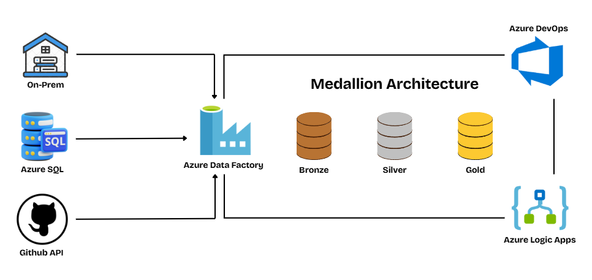

# **Azure Data Factory Project with DevOps**

---

## 🚀 **Project Summary**
This project focuses on ingesting data from multiple sources — **On-Prem**, **Azure SQL**, and **API** — while automating the end-to-end **ETL workflow** using **Azure Data Factory (ADF)**.  
The architecture follows a **Medallion Architecture** (Bronze → Silver → Gold) to ensure structured, incremental data refinement at each stage.

---

## 🧩 **Project Overview**
- Multi-source data ingestion  
- Automated ETL orchestration  
- Medallion architecture for data processing  
- Data transformation and standardization  
- Analytics-ready Gold layer  
- Azure DevOps integration for CI/CD  

---

## 🛠️ **Technology Stack**
- **Azure Data Factory**  
- **Azure SQL Database**  
- **Azure Data Lake Storage Gen2**  
- **Delta Lake**  
- **Azure Logic Apps**  
- **Azure DevOps**  
- **Git**  

---

## 🤝 **Contribute**
Found something that can be improved?  
Open an **issue** or submit a **pull request** — every contribution helps the project grow!  
